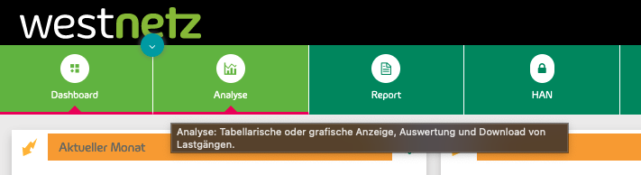
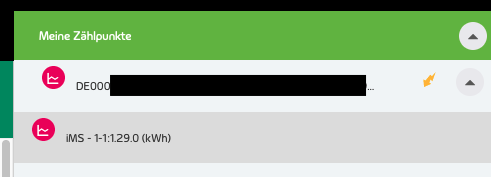
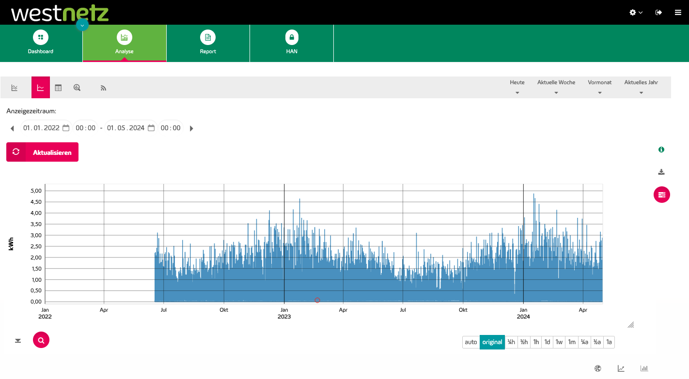
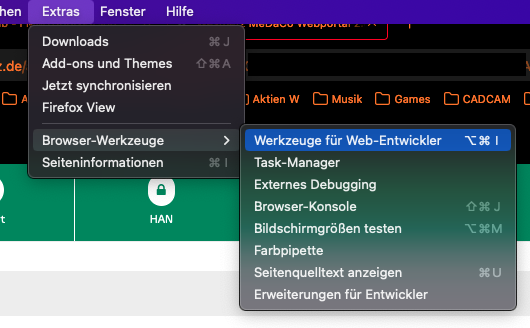

MeDaCo iMSys Tool
=================

Stay tuned, Leute ...


---
## Download der Daten

Hier mit besipielhaft mit Firefox.  

Den Button "Analyse" anklickern,
  

dann rechts den gewünschten Zählpunkt auswählen.  
  

In dem dann erscheinenden Diagramm die kleinste Zeiteinheit (i.d.R. 15min) oder "Original" festlegen.  
Das Laden kann eine Weile dauern.  
  

Im Firefox Menü "Werkzeuge für Web-Entwickler" wählen.  


> ACHTUNG  
> Standardmäßig beschränkt Firefox den Download von Dateien auf 1MB.  
> Das muss in den Einstellungen (```about:config```) geändert werden.  
> Wie das geht steht z.B. [hier][2].

Im Menu "Netzwerkanalyse" wählen, aktivieren und neu Laden.
  

[...]

  

  

  


[...]


---
## NEWS

### CHANGES 2024/05/XX:
    - ...

---
## TODO
    - ...


---
Have a nice day  
FMMT666(ASkr)


---
[1]: https://medaco.westnetz.de/login
[2]: https://stackoverflow.com/questions/51687462/firefox-developer-tools-truncates-long-network-response-chrome-does-not-show